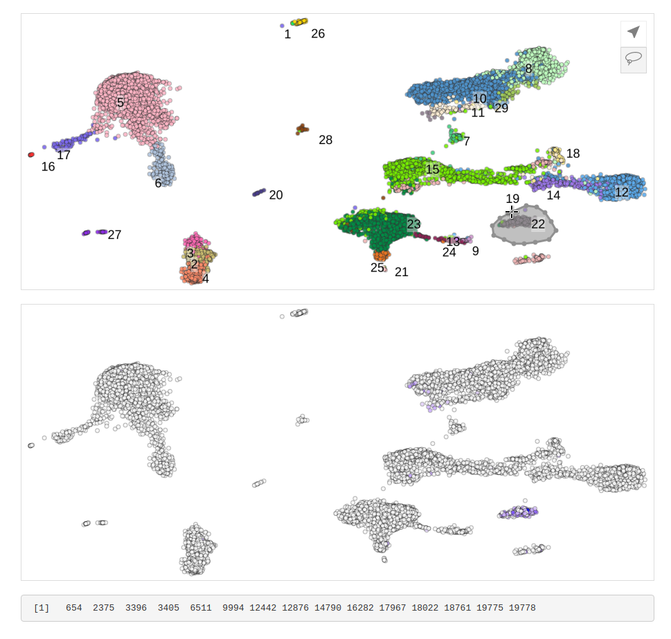

Overview
--------

`picker` lets you zoom, pan, and pick points from a scatter plot.





Installation
------------

```r

# install.packages("remotes")
remotes::install_github("hms-dbmi/picker")
```

Usage
-----

```R
library(shiny)
library(picker)

# load example data
load(system.file('extdata/pbmcs.rda', package = 'picker'))

# repel labels
if (require(repel)) {
    label_coords <- repel_text(
        label_coords, xrange = range(coords$UMAP1), yrange = range(coords$UMAP2))

} else {
    message("See https://github.com/hms-dbmi/repel to install repel")
}

# get colors for gene expression
exp <- scales::rescale(exp, c(0, 1))
expression_colors <- scales::seq_gradient_pal('#f5f5f5', 'blue')(exp)

ui = shinyUI(fluidPage(
    tags$head(tags$style(".picker {border: 1px solid #ddd; margin: 20px 0;}")),
    shiny::column(
        width = 6,
        pickerOutput('clusters', width = '100%', height = '400px'),
        pickerOutput('expression', width = '100%', height = '400px'),
        verbatimTextOutput('selected')
    )
))

server = function(input, output) {

    # show selected output
    output$selected <- renderPrint({
        input$clusters_selected_points
    })

    # coordinate views (zoom/pan)
    clusters_proxy <- picker_proxy('clusters')
    observeEvent(input$expression_view_state, {
        update_picker(clusters_proxy, input$expression_view_state)
    })

    expression_proxy <- picker_proxy('expression')
    observeEvent(input$clusters_view_state, {
        update_picker(expression_proxy, input$clusters_view_state)
    })


    # render pickers
    output$clusters <- renderPicker(
        picker(coords, cluster_colors, labels, label_coords)
    )
    output$expression <- renderPicker(
        picker(coords,
               expression_colors,
               labels,
               show_controls = FALSE,
               text_props = list(getSize=12))
    )
}

shinyApp(ui = ui, server = server, options = list(launch.browser = TRUE))
```
